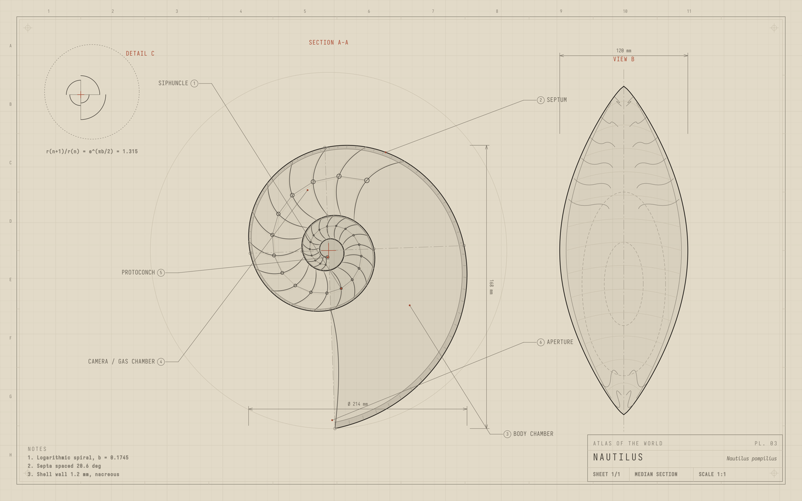

# Atlas Ink

A light e-ink Omarchy theme: graphite linework on warm beige paper.



Part of the **Atlas** pair: Atlas Ink and [Atlas Solitude](https://github.com/PhyAMR/omarchy-atlas-solitude). Eleven
wallpapers of procedural technical drawings (engine, fern, nautilus, dragonfly,
turbofan, flower, fish, earth, tree, beetle, radiolarian), generated by
[atlas](https://github.com/PhyAMR/atlas).

## Install

```bash
omarchy theme install https://github.com/PhyAMR/omarchy-atlas-ink
```

## What's in it

- `colors.toml`: the palette for terminals, the shell and apps.
- `shell.toml`: a fully transparent bar. Pair it with
  [Islands](https://github.com/PhyAMR/omarchy-islands), which draws the floating
  pills; `islands.json` holds their colours.
- `backgrounds/`, `preview.png`, `unlock.png`, `icons.theme` (Yaru-sage icons)
- `hyprland.lua` (thin gradient borders, rounding 6) and `neovim.lua` (e-ink.nvim colorscheme).
  **Omarchy ignores `.lua` files in themes installed with `omarchy theme install`**,
  as a safety rule, so to get these, clone the repo and link it instead:

  ```bash
  git clone https://github.com/PhyAMR/omarchy-atlas-ink ~/code/omarchy-atlas-ink
  ln -sfn ~/code/omarchy-atlas-ink ~/.config/omarchy/themes/atlas-ink
  omarchy theme set "Atlas Ink"
  ```

To re-render the wallpapers, see [atlas](https://github.com/PhyAMR/atlas).

## License

MIT, see [LICENSE](LICENSE).
